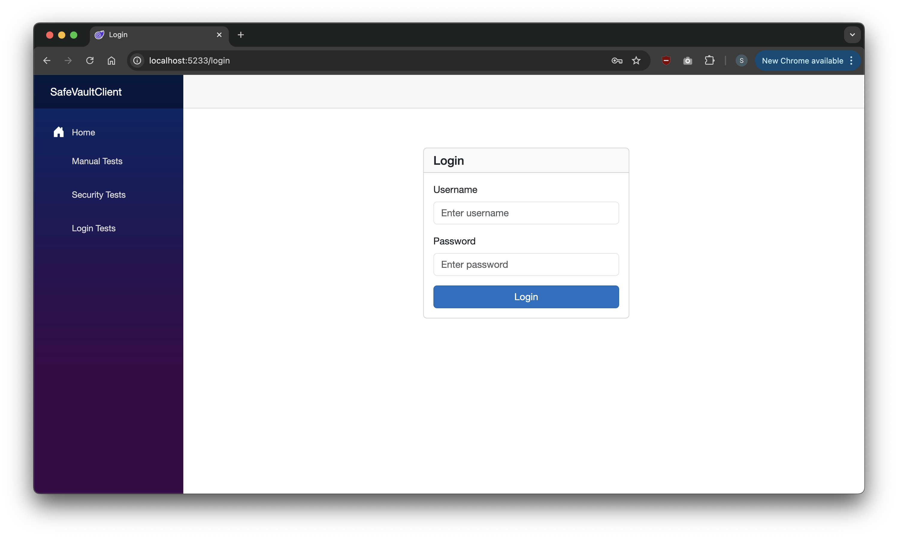
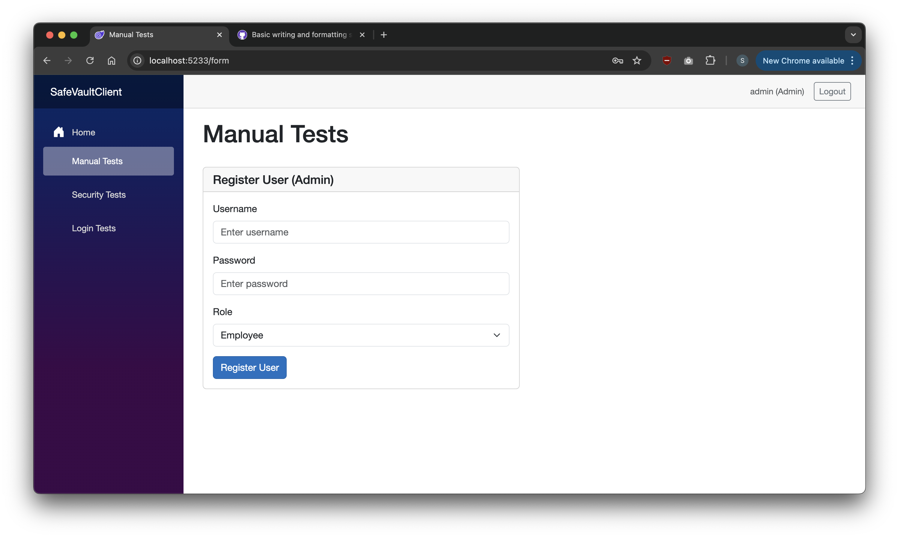
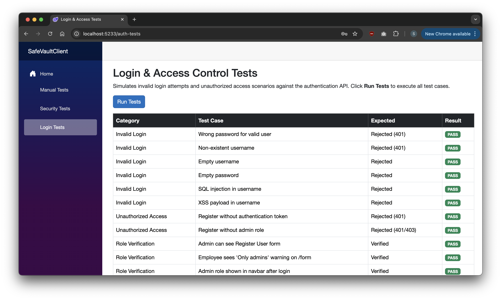

# SafeVault

A full-stack secure vault application built with Blazor WebAssembly and ASP.NET Core Minimal API, demonstrating input validation, authentication, authorisation, and security testing.

## Running the Application

Start both projects, then open the client in a browser:

```bash
# Terminal 1 — Start the API server
cd SafeVaultServer
dotnet run

# Terminal 2 — Start the Blazor client
cd SafeVaultClient
dotnet run
```

Open **http://localhost:5233** in your browser. The server runs on `http://localhost:5202`.

### Logging in and Registering Users

A default admin account is seeded automatically on server startup. Use it to explore role-based access control:

1. Navigate to **http://localhost:5233** — you will be redirected to the login page
2. Enter username **`admin`** and password **`Admin@123`**
3. You will be logged in as `admin (Admin)`, shown in the top-right corner
4. Click **Manual Tests** in the sidebar to access the Register User form
5. Enter a username, password, and choose a role — **Employee** or **Admin**
6. Click **Register User** — the stored password hash is displayed below the form to demonstrate that plaintext passwords are never persisted

To test role restrictions, log out and log back in with a registered Employee account. The Manual Tests page will show a warning instead of the registration form, and the Login & Access Tests page will record this as a passing role verification.

> **Note:** Registered user passwords must satisfy ASP.NET Core Identity defaults — at least one uppercase letter, one digit, and one special character (e.g. `Test@123`).



## Project Structure

- **SafeVaultClient** — Blazor WebAssembly front-end on http://localhost:5233 (login, user registration, security test pages)
- **SafeVaultServer** — ASP.NET Core minimal API on http://localhost:5202 (Identity, JWT authentication, SQLite)
- **SafeVaultShared** — Shared class library containing input validation logic used by both client and server
- **SaveValueTest** — Console-based test harness for validation methods

## Copilot Reflection

### How Copilot Assisted

**Generating secure input validation**

I directed Copilot to create the `InputValidation` class in `SafeVaultShared`. My approach was to use a whitelist — only alphanumeric characters and an explicitly allowed set of special characters pass validation. Copilot implemented `IsValidInput(string input, string allowedSpecialChars)` and `IsValidPassword(string password)` based on this directive. The decision to place validation in a shared library (so both client and server reference the same logic) was mine; Copilot handled the implementation and ensured the methods were called in `AuthController` before any Identity operation.

**Implementing authentication and RBAC**

I specified the architecture: ASP.NET Core Identity for user/role management, JWT Bearer tokens for stateless API auth, and `AuthorizeView` components on the client for role-gated UI. Copilot implemented each piece from those directives — wiring up `AddIdentityCore` with `AddRoles`, configuring `JwtBearerDefaults`, generating the `AuthController` with token generation, creating `AppAuthStateProvider` to parse JWT claims client-side, and building `AuthService` to manage login/logout state. The structural decisions (two roles, admin-only registration, separate login page) were mine throughout.



**Building security test pages**

I asked Copilot to create test pages modelled on the existing `SecurityTests.razor` pattern. It generated the SQL injection and XSS test vectors, the password validation test cases, and the live API test harness in `LoginTests.razor` that exercises invalid logins, unauthenticated access, and role verification scenarios.

### Debugging and Vulnerabilities

Bug diagnosis is where Copilot added the most value. Several issues during development were not obvious from error messages or documentation alone:

**`AddIdentity` vs `AddIdentityCore`** — After implementing JWT auth, every authenticated API request returned 401 or 403. The cause was that `AddIdentity` silently registers cookie authentication as the default scheme, overriding the JWT Bearer configuration. Copilot identified the distinction and replaced it with `AddIdentityCore` + `AddRoles`, which provides `UserManager` and `RoleManager` without hijacking the auth scheme. This was not clearly documented and would have taken significant time to diagnose manually.

**JWT claim type remapping** — Admin users were consistently treated as Employees. `IsInRole("Admin")` always returned false despite the token payload containing `"role": "Admin"`. Copilot identified that the JWT middleware's default `MapInboundClaims` behaviour silently remaps the short-form `"role"` claim to the long-form URI `http://schemas.microsoft.com/ws/2008/06/identity/claims/role`, while `RoleClaimType = "role"` tells the identity to look for the short form. The fix was `MapInboundClaims = false`. This was a silent failure — no exception, no log — and Copilot diagnosed the full claim-mapping chain.

**Token lost on page refresh** — The JWT was stored only in a C# field. Any browser refresh tore down the Blazor WASM runtime and rebuilt it, losing all in-memory state. Copilot generated the `localStorage` persistence layer and the `InitializeAsync` startup flow to restore the token and `Authorization` header before any route renders.

The full list of vulnerabilities identified and fixed:

| Vulnerability                    | How It Was Found                                                                                       | Fix Applied                                                                                                    |
| -------------------------------- | ------------------------------------------------------------------------------------------------------ | -------------------------------------------------------------------------------------------------------------- |
| **SQL Injection**                | Tested with payloads like `admin' OR '1'='1` and `'; DROP TABLE Users; --` via the Security Tests page | `InputValidation.IsValidInput` rejects SQL metacharacters; EF Core uses parameterised queries                  |
| **XSS**                          | Tested with `<script>alert('xss')</script>` and similar payloads                                       | Input validation rejects `<`, `>`, and HTML metacharacters; Blazor auto-encodes output                         |
| **Plaintext Passwords**          | Identified during initial implementation with raw SQLite                                               | Migrated to ASP.NET Core Identity (PBKDF2 hashing); registration form displays the stored hash as verification |
| **Default Auth Scheme Conflict** | All API requests returned 401/403 after adding Identity                                                | Replaced `AddIdentity` with `AddIdentityCore` + `AddRoles`                                                     |
| **JWT Claim Type Mismatch**      | Admin users treated as Employees; `IsInRole("Admin")` always false                                     | `RoleClaimType = "role"` and `MapInboundClaims = false`                                                        |
| **Token Lost on Refresh**        | Page refresh redirected authenticated users to login                                                   | Persisted token to `localStorage`; restored on startup                                                         |

### Challenges and How Copilot Helped

**Silent failures are the hardest bugs.** The claim type mismatch and the `AddIdentity` scheme override both produced no exceptions and no useful log output. The application appeared to work — login succeeded, tokens were issued — but authorisation silently failed. Without Copilot tracing the internal claim-mapping pipeline, these would have required reading framework source code to diagnose.

**Blazor WASM state management is unintuitive.** Coming from server-side .NET, the expectation is that service state persists. In WASM, a page refresh destroys everything. Copilot identified this as the root cause immediately rather than chasing red herrings in the auth configuration.

### What I Learned About Using Copilot Effectively

**Directing is faster than describing.** Copilot works best with specific, concrete tasks: "implement JWT generation with these claims", "add an admin-only policy to this endpoint", "persist the token to localStorage". Vague requests produce generic output that needs significant revision.

**Copilot accelerates implementation, not decisions.** The architecture — shared validation library, Identity + JWT, role-gated UI, separate test pages — came from my understanding of the requirements. Copilot's role was to implement those decisions correctly and quickly, not to make them.

**Bug diagnosis is the highest-value use case.** Writing straightforward CRUD code is fast either way. Tracking down a silent claim remapping or a framework default that overrides your configuration costs far more time without assistance. Copilot identified the `AddIdentityCore` fix, the `MapInboundClaims` behaviour, and the localStorage persistence pattern faster than documentation or Stack Overflow would have.

**Generated code still needs review.** Copilot's initial `AddIdentity` call was technically correct in isolation but wrong in the context of a JWT-based API. Reviewing generated code against the full system context — not just whether it compiles — is essential.

## Security Tests

Two dedicated test pages validate the application's security. Both are accessible without logging in, so any user can verify the security posture.

### Security Tests (`/security-tests`)

Client-side tests that run `InputValidation` against known attack payloads:

- **SQL Injection** — 5 injection patterns (UNION, DROP TABLE, boolean logic bypass, comment injection)
- **XSS** — 5 XSS vectors (script tags, event handlers, javascript: URIs)
- **Password Validation** — Tests that malicious passwords are blocked while valid ones are allowed


### Login & Access Tests (`/auth-tests`)

Live API tests against the authentication endpoints:

- **Invalid Login Attempts** — Wrong password, non-existent user, empty credentials, SQL injection in username, XSS in username
- **Unauthorised Access** — Attempts to register users without a token and without admin privileges
- **Role Verification** — Confirms Admin and Employee roles behave correctly across the UI



## Tech Stack

- .NET 10.0, Blazor WebAssembly, ASP.NET Core Minimal API
- ASP.NET Core Identity with EF Core (SQLite)
- JWT Bearer Authentication
- SafeVaultShared class library for input validation
